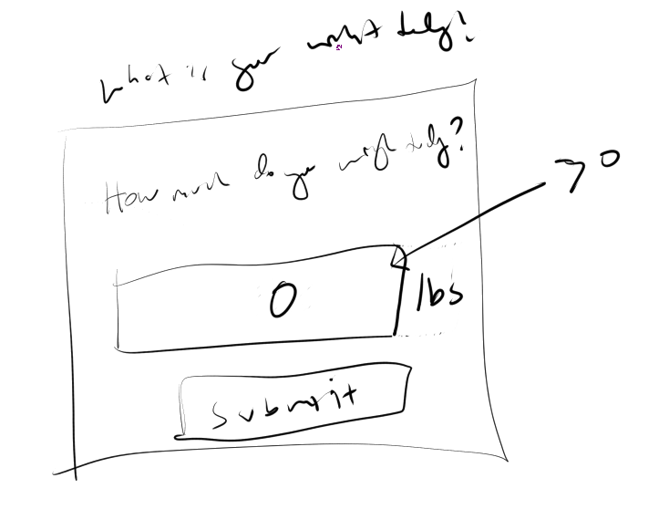

### TODO Features
- [ ] picture with calorie "group" saving eg. burger, could be broken down, not sure if needed
- [ ] charting to show progression 2 or more lines(weight, calorie intake)
- [ ] method to purge data like in TT

### 02/09/2020
- [x] modify indexed db data structure to include saved food items
- [ ] modify search input to be able to show a dropdown to pick from and set the active state
  - [x] prototype UI changes
  - [ ] link to Dexie
    - [x] basic save/get
      - [x] add check to stop re-saving
      - [x] add way to delete 

### 12/03/2020
Added back in PWA thanks to this [SO post](https://stackoverflow.com/questions/56122942/create-react-app-service-worker-not-functioning).
In the past CRA just had the PWA stuff working out of the box.
I also am aware I deployed stuff that could be considered secret regarding the deployment urls but it's fine.
The data is stored to your own device/no APIs are used. This is also a random domain I bought/setup https for.

### 12/02/2020
I'm just going to add some small features. Added empty check as I accidentaly did that and it went through/messed up UI some.
- [x] update schema
- [x] make basic modal input
  - rough idea of design:
    - 
- [x] add useeffect check for weight to prompt weight input
  - nasty triple-state... just due to async nature, needed to plan better, also code should be separated (tech debt "fix it later")
### 12/01/2020
So I've become pretty unpleasantly thicc with this pandemic. I used to hit up the gym on avg 5 days a week. [This was 2-3 years ago](https://i.imgur.com/9ltGrAZ.png) I was working a job standing up, working out insane like sometimes 3 hours straight. I wasn't ripped but I had some definition. I also didn't have a car/was roller blading home 5 miles. I think the lowest I had weighed at this time was between 205-215 lbs. Right now I'm 253lbs lmao... CHONK. It's all irrelevant in the end as not really social anymore... still I'd rather look good than bad.

Ahh... man I feel spent mentally though. I have been in a rut like over the weekend/Thanksgiving break. I had one day of productivity, rest of it I just felt like doing nothing/binge ate... (that's what why I'm so thicc)

I did have a feature thought, I'll log my daily weight as well. Eventually should see a relationship between the calories against baseline and weight drop over time. The calorie counter does have the ability to subtract for exercise but as mentioned I mostly live in a box.

### 11/27/2020
So... my old piece of crap code was too annoying to fix.
Also I am not exactly a goshujinsama in async stuff... ahh 2 hours gone.
Easier to start from scratch than relearning the hectic state management and poor architecture I built 17 months ago.
I did like the base interface design/color palette so I will try to salvage that.

I'm going to work on the clu project real quick though, the plotting where I just assumed it would work as is did not.
Also the term is "visual inertial semantic representation" that's OP, pathetic what I'm trying to do compared to that.